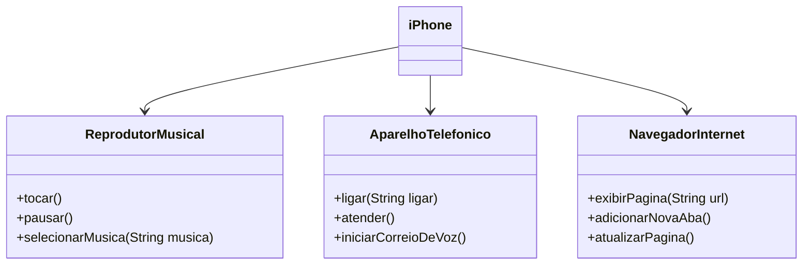

## Desafio de Programação Orientada a Objetos

Neste desafio, fui responsável por modelar e diagramar a representação UML do componente iPhone, abrangendo suas funcionalidades como Reprodutor Musical, Aparelho Telefônico e Navegador na Internet.

### Contexto

Com base no vídeo de lançamento do iPhone de 2007, foi elaborada a diagramação das classes e interfaces utilizando uma ferramenta UML de sua preferência. Em seguida, implementada as classes e interfaces no formato de arquivos `.java`.

### Funcionalidades Modeladas

1. **Reprodutor Musical**
> - Métodos: `tocar()`,`pausar()` e `selecionarMusica()`.
2. **Aparelho Telefônico**
> - Métodos: `ligar(String numero)`, `atender()` e `iniciarCorreioVoz`.
3. **Navegador na Internet**
> - Métodos: `exibirPagina(String url)`, `adicionarNovaAba()` e `atualizarPagina()`.

## Diagrama UML

## Minhas redes de contato

  
   
  
  

